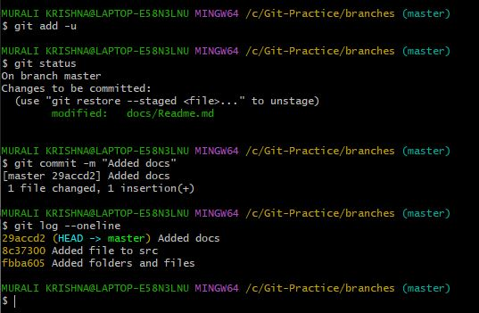
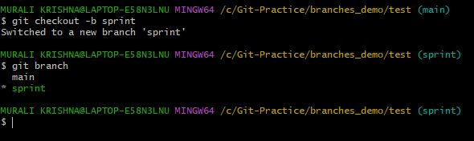

## Version Control Systems

* Software which helps organizations to maintain the source code
* VCS helps in `maintaining history of changes` and also allows us to maintain track of different releases which we give to customers
* It allows `parallel development` by multiple developers

### Types of VCS

  1. Local Version Control System
  2. Centralized Version Control System


  3. Distributed Version Control System


## Git 

* _**Distributed Version Control System**_
* Options for remote repos :
  
  1. Self hosted
     * Host it on your own
     * Options :
        * Gitolite
        * Git lab Selfhosted

  2. Cloud hosted
     * Hosted by some service provider
     * Options :
        * GitHub
        * GitLab
        * Azure Source Repos
        * AWS Code Commit
        * Bit Bucket
          
* `GITHUB` : OpenSource (now acquired by Microsoft)
* History of Git :

[Refer here : https://git-scm.com/book/en/v2/Getting-Started-A-Short-History-of-Git ]

* Cheatsheet for Github  (downloaded)

[Refer here : C:\Users\Harika\Desktop\DEVOPS + AWS\DEVOPS ]

### Git Workflow


### Git as local repository

* Having one user and one system
* Repository - storage space - maintaining history,
  e.g: google drive

### Starting with GitBash

* We enter into the `directory/`folder using `cd c/Git-Practice/`
* Create a folder `hellogit` inisde the first folder
* Using `pwd`(Pesent Working Directory) we can know the current directory
* Using `start .` the window will open where the folder/directory being created


* For making it a local repo we use `git init` command (.git folder with some sub folders gets created in the previous window)


* In the `.git` folder we have both local repo and the working tree
* Here `hellogit` is the working tree
* Now the changes versioned will be stored (history stored) in the local repo
* Now we create a folder `src` (coding done area) and a python based empty file `file.py`
* To check for any changes happened we ask for `git status`
* To ask for status we need to be in the `.git` folder or it's subfolders


* For here we have folder `src` (we have a change)
* Now to move the changes _**from working tree to staging area**_ we use `add` command
* Now the color changes from `red to green` to tell git about when you are changing and what are being changed 


* To move the changes _**from staging area to the local repo**_ we `commit` them along with the `message -m`
* Every `commit in git is a history recorded`


* Now check the status
* 'Working tree clean' in the status, shows that every thing we have in the working tree and the local repo are same
* Now to _**check the history**_ we use `log` command `git log`
* To show the history in a single line we use `git log --oneline`
* Every strange number for commit is the `commit id`


* Now we do another change, check status, add changes and finally commit the changes


* _**Travelling back and forth**_ with the commit id's using the `checkout` command


## Hashing (Commit ID)

* generates random numbers
* message is same, so the hash will be same
* Even a message is large, the hash created remains of same no.of digits
 
 ## Creating a senerio

 * First commit - create folder understanding with src, test folders
 * Second commit - Add files to src, test folders (main.py, each)
 * Third commit - Add any content into the files
 * Find logs for the above commits :


 
## Plumbing Commands

* For better understanding, we use these commands :
```
git cat-file -t <commit-ID> (type of content in the file)
git cat-file -p <commit-ID> (prints the content of the file)
```


* Type and contents of the commits made :

  1. Parent - previous commit
  2. Author/Commiter - username & email configured
  3. Message - the message we give
  4. Tree - folder/directory
  5. Blob - file

* Let's check for previous commits :


* Now checking the commit contents :

  1. First Commit


  2. Second Commit

* Here the contents from the previous commit, so the hash will be same for both src and test files


* Now check the contents of the src file
* Here the _**hash**_ of the blob of src and the Readme.md will be _**same**_ as the _**content remains the same**_


* Here src is an `empty file`


  3. Third Commit


* Now opening the tree


* Now opening contents of the src file


* Now displaying the content of the file


# Git Branching

* Branch in git always points to a latest commit id
* We checkout for branches using git branch command
* Master - points to the latest commit
* Branch allows us for parallel development in the same repo

* Now let's create a local repo and (git init) into it


* Make some changes having folders and files


* Add and Commit the changes


* Making another change and commit


* Here the head and master both pointing to the same commit(latest commit)
* Now we create a branch R-1(First release) where the head points to the branch 


* Here after moving into the branch using checkout command , now both he master and the head points to the branch


* Now when we add a change in the branch and commit it, head points to the branch or latest commit made


*Now we got to master and check the history


* Now let's make changes to the master
* To update only the modified files we use, (git add -u) command
* Now both head and master points to this latest commit



* To have changes from one branch to another,we need to work with
    1. Merge - Three-way merge
             - no fast forward merge
    2. Rebase
    3. Cherry pick   

* The above processes may also lead to some conflicts (Merge conflicts)

## Git Merging
* create a new folder (branches_demo) and make it a local repo
* Make the changes,add and commit


* Now let's change the branch name from master to main


* create a commit on main


* Let's create a branch sprint from the main branch
  (git checkout -b sprint)
          or
  (git branch sprint, git checkout sprint)
* Here the sprint also points to the same commit such as main

    

* we make a change in the sprint and also create a file
* To only add modified files ignoring the new created files, we use (git add -u)


## FAST FORWARD MERGE

* Now the current state of the branches is


Before Merge the picture


* To obtain all the changes from the sprint branch to the main, we need to merge and to achieve that we need to be present in the target branch(i.e, main)
* This is called the FAST-FORWARD merge
* Here the merge happens as the main combines with the latest commit(i.e, sprint)

After Merge the picture


Command Section


## THREE WAY MERGE

* Now make changes and commit to main branch


* Here we have added msg to src/main.py, added only the modified file and commited
* So we have 3 commit's now


* Current state


* Now we have different msg in both the src files of main branch and sprint branch
* Now while we merge there arises a conflict as to which to be stored, but for the test file there is only 1 msg stored (no conflict)
* This is to be resolved by the developer as to choose the display


* Now the new commit has to be made with a main commit and a sprint commit
* Three commit's being involved (3 way merge)


* To resolve this conflict, we use notepad editor along with git generated lines as


* Now make the changes and save the file as


* And the command line follows as


* Here the merge commit has two parents and also the graph (git log --graph --all)represented as


## EXERCISE


## SOLUTION


* branches created


* commit a change in sprint_poc


* commit a change in sprint_dev


* Merging sprint_poc into sprint_dev


* We look at all the senerio using graph representation using (git log --graph --oneline --all)command


## Git Rebase

* Create a scenerio as follows


* Rebase is a command used to get changes from one branch to other by rewriting history
* Make two changes and commit them in the main branch
* To directly add and commit at same time we use (git commit -am "message") command


* Now the chnages in the main branch to be merged into sprint branch, we have two ways to do this

1. Three way merge as follows (confusing approach)


2. Rebase as follows (cleaner approach)

* Rebase is useful for all the child branches but never rebase main/master from child as rebase rewrites history.
* To rebase we checkout sprint and rebase to main using (git rebase main) command


* Here arises a merge conflict, with the src/main.py
* we open the file in notepad, edit with changes and now rebase again using (git rebase --continue) command


* Now after the rebase the commit id of the sprint branch gets changed as the parent get's changed and also shows that it is replaced after the main branch


* This is nothing but the rewriting of the history

## Git Cherry pick

* If we need to pick specific commits or specific range of commits (sequence) of commits , cherry pick can be used
* Firstly, we add two commits


* Performing changes from any commit to any branch
* Now consider the above, we want changes from commit (commit id - 97bb278) into main branch
* So we use cherry pick
 * first checkout the target/destination
 * use cherry-pick(git cherry-pick 97bb278)command


## Remote Repository

* Git Remote Repository is any folder on any server
* To make Git Remote accessible, generally two protocols are widely used
   1. http(s)
   2. ssh
* There are many popular Git Repositories which are available for free.
* lets get started with GitHub
* Create a new repository in GitHub


 

  


 

 